# Amazon-Assesment

# Forking Github Repositories

This user guide teaches recent Github users how to fork a Github repository and implement changes. It will center around MacOS systems.

In short, forking and editing a repository follows these steps:

1. [Fork the original repository to create a copy](#how-to-fork-a-github-repository)
2. [Clone and edit the copied repository with the terminal](#the-terminal-and-cloning-the-repository)
3. [Create a pull request](#create-a-pull-request)
4. [Original repository owner reviews and merges pull request](#merging-the-code)
  

# Explaining Github

Github is a code-hosting service that can track and save code. It connects to a user's code editor and allows open-source access to that user's repository (space where code is stored). In other words, Github allows for collaboration between different users on the same projects. 

One popular method Github users use to collaborate on repositories is called **Forking**. Forking is when users take a copy of a repository into their accounts and clone it into their local computers to make edits. This method is in contrast to direct **Cloning**, which forgoes forking and only clones down the original repository.
  

    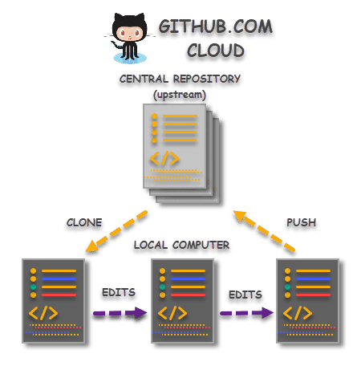
    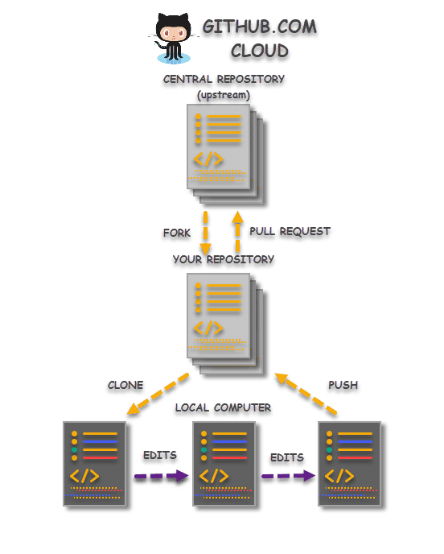

The first image illustrates the developer process when cloning without forking, while the second illustrates the process with forking.
  

Cloning the original repository can quickly update projects since invited users can push changes at any time. However in group projects, this can lead to unwanted changes in the main code if users are not communicating effectively. Therefore this process is suited better for groups that decentralize their assignments. 

Forking a repository allows for wider access to Github users since they can edit any public project with supervision. Merging edits with the original repository occurs only with that repository owner's permission. It leaves room for reviewing code and ensuring changes are satisfactory.
  
# How to Fork a Github Repository
To fork a repository, locate a repository to work on through public access or an invitation from the owner. Once on the homepage for the project, click the **Fork** button located in the top-right corner of the browser and near the profile icon.
  
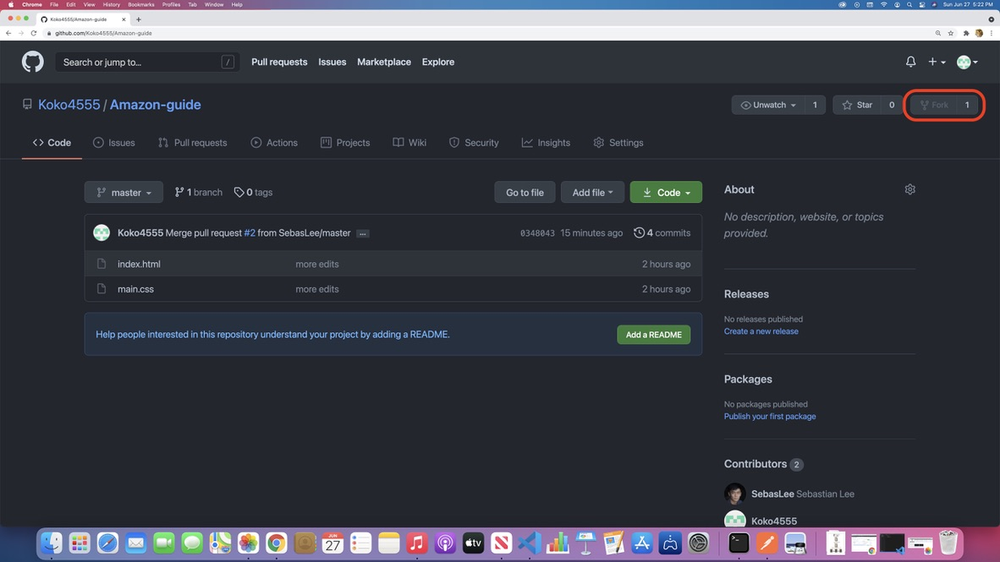
  

This will create a copied repository that can be edited. The top left corner of the page will now indicate the repository is under the user's account. 
  
# The Terminal and Cloning the Repository

The **terminal** is a computer interface that connects to the command line, where users can effectively communicate with their computer's operating system and outside sources. It is key to connecting Github accounts to code editors.

To gain access to the code, click on the green **Code** button in approximately the upper-center-right of the page, indicated by the red circle. 
  
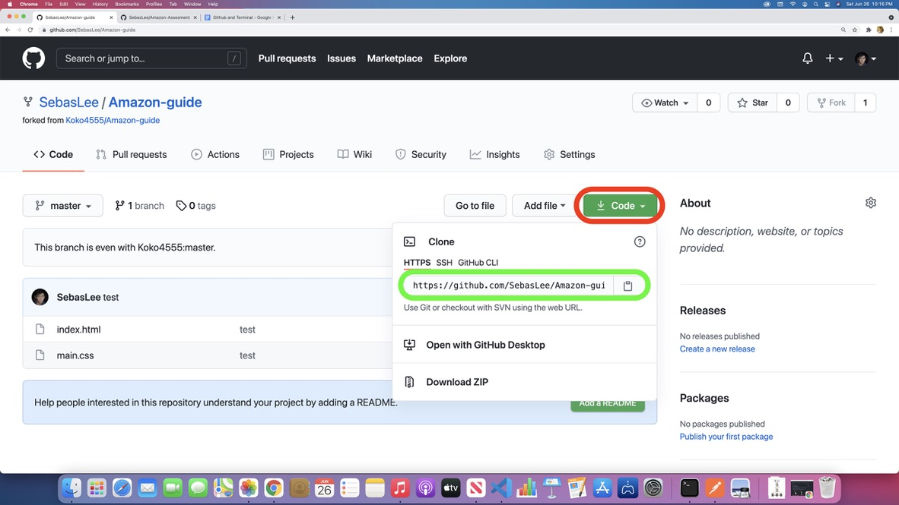
  

A pop-up will appear with options and an HTTPS URL link indicated by the green circle. Copy the link. Next, open the terminal and navigate with ``cd`` (change directory) to the desired location for the repository's code.

Once an appropriate location is found, enter in ``git clone`` followed by the copied HTTPS link.
  
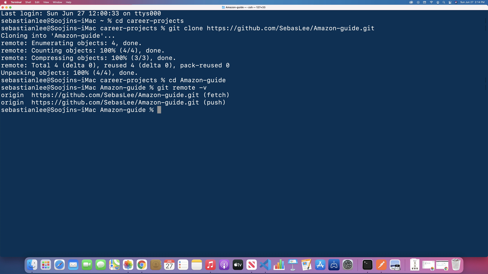
  

The terminal will form the copied repository's files into the computer's system. The URL can be verified with the ``git remote -v`` command, which will show the repository under the Github username. To initiate the project, navigate with ``cd`` to the repository and open it with the preferred code editor (``code .`` for VScode). 
  
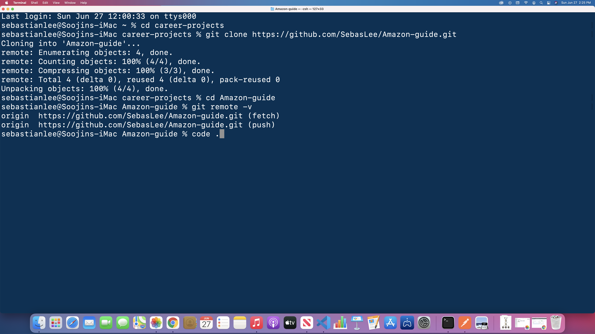
  

Code can now be edited or added. To save and transfer altered code to the forked repository, type these commands in the terminal in the following order: ``git add .``, ``git commit -m "message"``, then ``git push origin default-branch``.
  
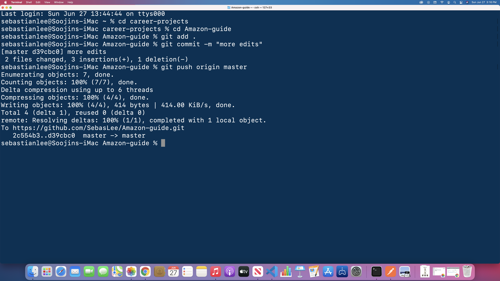
  

``git add .`` will stage new or changed files to be sent to Github. ``git commit -m "message"`` takes a snapshot of the code along with a custom message inside the double quotations to describe the changes. 

``git push origin default-branch`` pushes the altered code to the repository. Be aware that the ``default-branch`` in this command is usually named ``master`` or ``main``. To verify the branch name, type in ``git branch`` before pushing the code. 

For this example, ``git branch`` returns ``master`` for the branch name. Therfore the push command is ``git push origin master``.
  
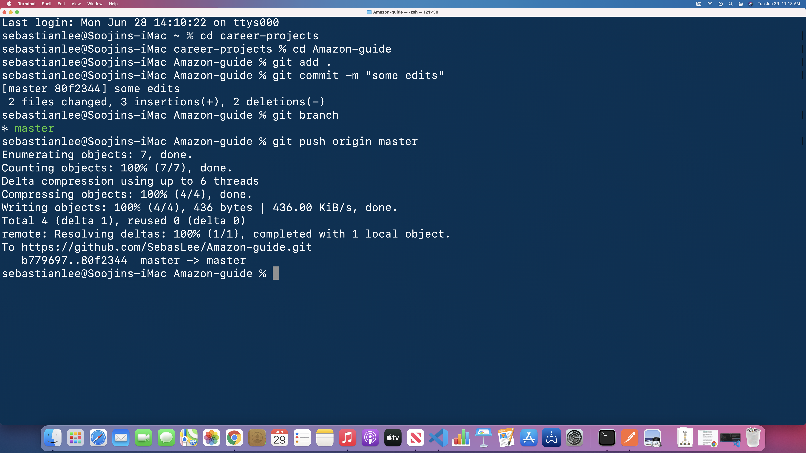
  
# Create a pull request

With edited code now in the copied repository, merging it with the original repository can be initiated with a **pull request**. 

On the copied repository's main page, click on the **Pull requests** tab on the navigation bar below the repository name. 
  
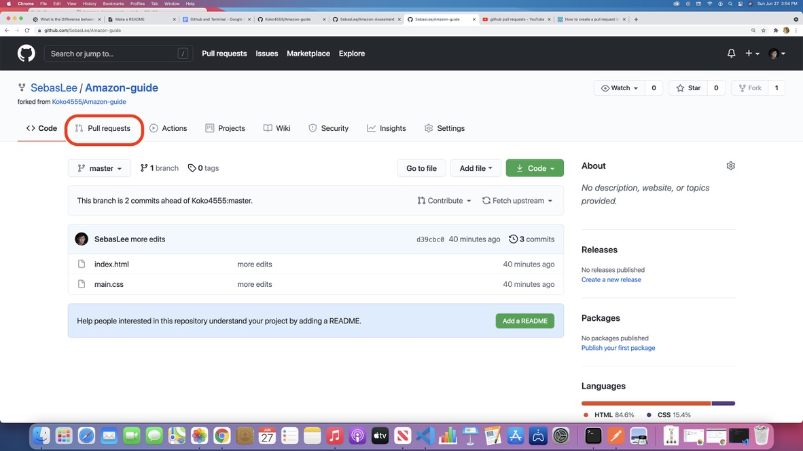
  

Once on the new page click on the **New pull request** button on the right side of the page.
  
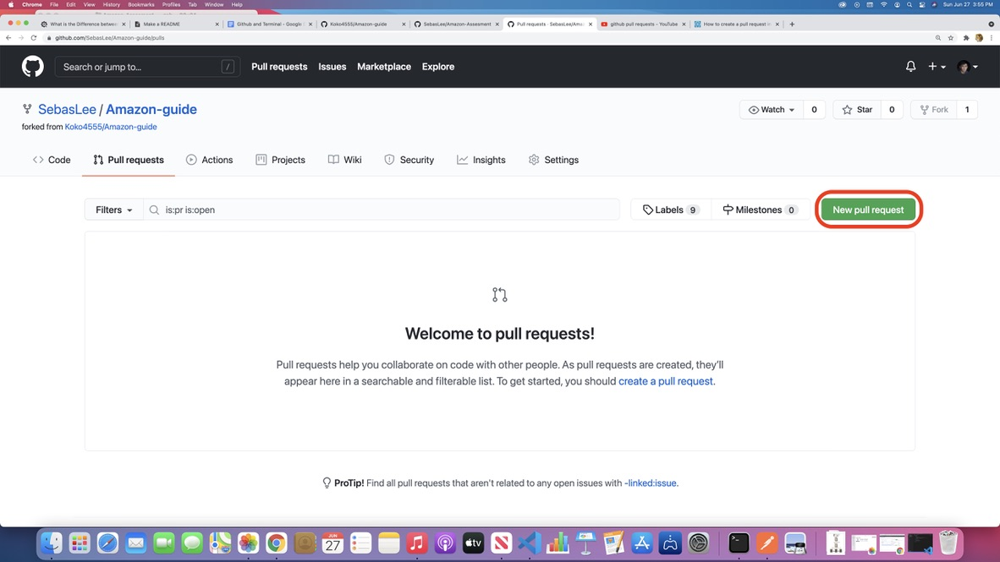
  

Any additions or deletions to the code can be reviewed and compared. The green square indicates the route the copied repository's code will take to reach the original repository. Ensure that the branch names are correct to receive the **Able to merge** prompt. If there are no other errors, click on the **Create pull request** button.
  
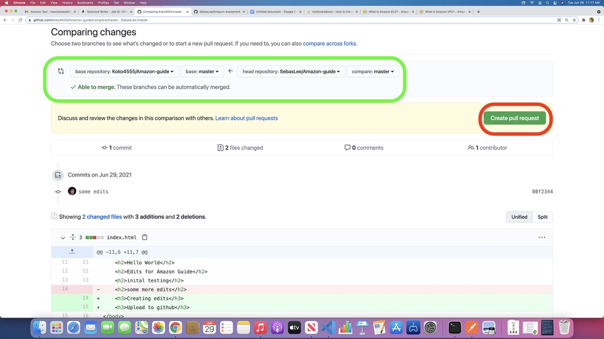
  

On the new page, custom messages can be created to explain the edits. When ready, click on the **Create pull request** button to send the changes to the original repository owner.
  
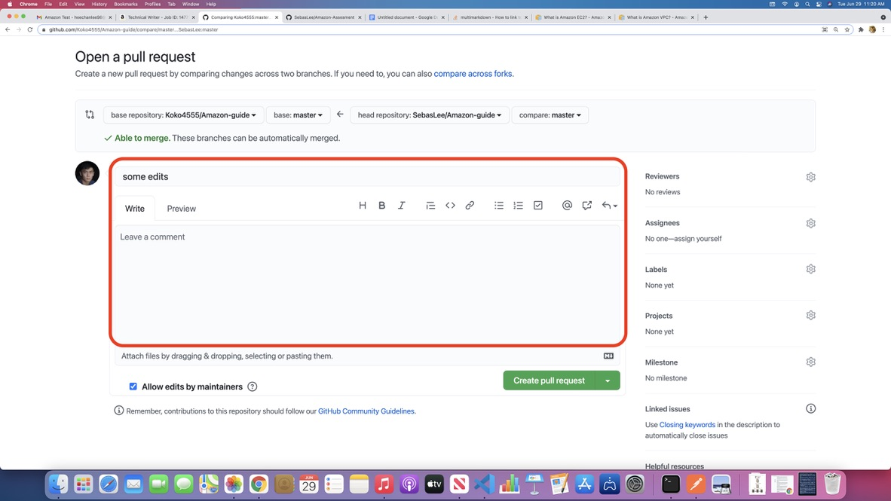 
  
# Merging the pull request

The owner can now review the pull request on the pull requests page.
  
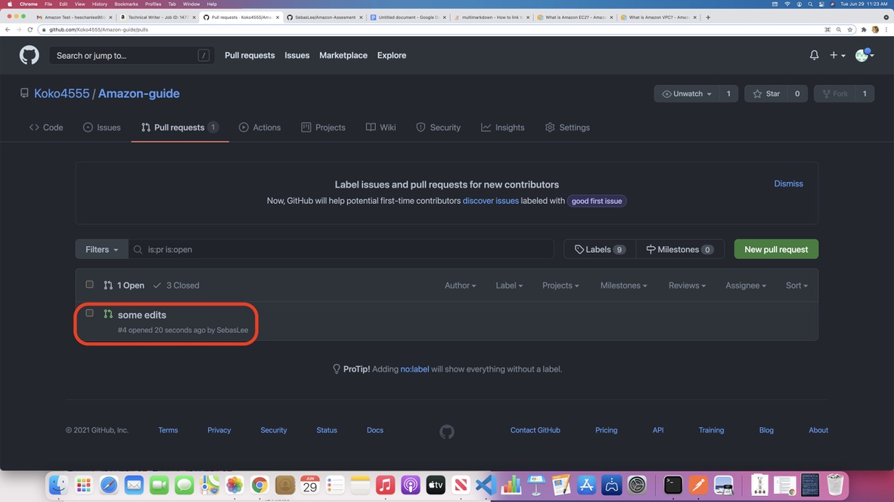
  

The green circle indicates the requested changes for the repository that the owner can review before merging. If edits are satisfactory, the owner can click on the **Merge pull request** button and confirm integrating the code.
  
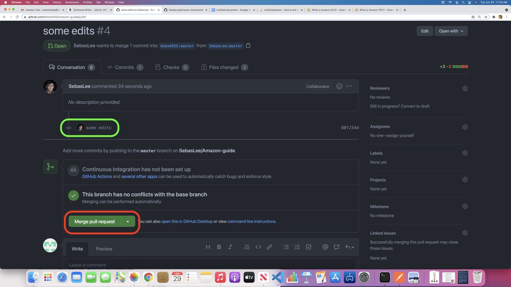
  